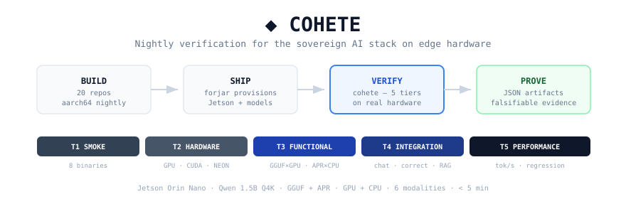

<p align="center">
  
</p>

# Cohete

Nightly E2E verification proving the sovereign AI stack works on edge hardware.
One binary, five tiers, falsifiable JSON artifacts.

```
20 repos build nightly  →  forjar provisions  →  cohete verifies  →  artifacts prove it
```

<!-- NIGHTLY:BEGIN -->
*Last run: **2026-03-11** — **FAIL** (965s)*

### Tier Results

| Tier | Name | Status | Passed | Failed | Skipped |
|------|------|--------|--------|--------|---------|
| 1 | Smoke | ✅ | 8 | 0 | 0 |
| 2 | Hardware | ❌ | 0 | 1 | 0 |
| 3 | Functional | ✅ | 6 | 0 | 2 |
| 4 | Integration | ✅ | 22 | 0 | 1 |
| 5 | Performance | ✅ | 0 regressions | — | — |

### Binary Versions

| Binary | Version | Status |
|--------|---------|--------|
| `apr` | 0.4.10 (6d34b823) | ✅ installed |
| `whisper-apr` | 0.2.4 | ✅ installed |
| `trueno-rag` | 0.1.5 | ✅ installed |
| `forjar` | 1.1.1 | ✅ installed |
| `pmat` | 3.7.0 | ✅ installed |
| `copia` | 0.1.3 | ✅ installed |
| `pzsh` | 0.3.5 | ✅ installed |
| `batuta` | 0.7.2 | ✅ installed |

### Format x Backend Matrix

|        | GPU | CPU |
|--------|-----|-----|
| **GGUF** | ⚠️ 18.4s | ✅ 13.3s |
| **APR** | — | — |

### Correctness (M3): 6/6 passed

### UAT: Real-World Problem Solving

| Suite | Passed | Total | Status |
|-------|--------|-------|--------|
| U1 Chat Solving | 5 | 5 | ✅ |
| U2 API Validation | 6 | 6 | ✅ |
| U3 Kernel Provability | 4 | 4 | ✅ |
| U4 Task Chaining | 4 | 4 | ✅ |

### Performance

| Metric | Value |
|--------|-------|
| Inference | — |
| Whisper RTF | — |
| RAG query | — |
| Memory available | 5 GB |

### Hardware

| Property | Value |
|----------|-------|
| GPU | Orin (nvgpu) |
| CUDA | 12.6 |
| NEON | no |
| JetPack | # R36 (release), REVISION: 5.0, GCID: 43688277, BOARD: generic, EABI: aarch64, DATE: Fri Jan 16 03:50:45 UTC 2026 |
| Power | 15W |
<!-- NIGHTLY:END -->

## Quick Start

```bash
# Install
cargo install --git https://github.com/paiml/cohete

# Pull a model (~1 GB, cached in ~/.cache/pacha/models/)
apr pull hf://Qwen/Qwen2.5-Coder-1.5B-Instruct-GGUF/qwen2.5-coder-1.5b-instruct-q4_k_m.gguf

# (Optional) Create .apr copy to verify both formats
apr import ~/.cache/pacha/models/*.gguf -o ~/.cache/pacha/models/qwen-1.5b-q4k.apr --preserve-q4k

# Run
cohete verify --stdout --allow-missing
```

Model auto-discovery: `--model <path>` > `COHETE_MODEL` env > `~/.cache/pacha/models/` scan.

## Test Tiers

| Tier | Name | What It Proves | Budget |
|------|------|----------------|--------|
| 1 | **Smoke** | All 8 binaries installed, `--version` + `--help` | 10s |
| 2 | **Hardware** | GPU, CUDA, Vulkan, NEON, memory, disk | 15s |
| 3 | **Functional** | Inference across format x backend matrix, transcription, tool smokes | 120s |
| 4 | **Integration** | Chat server, 6 correctness tests, load test, RAG pipeline | 120s |
| 5 | **Performance** | tok/s baseline, whisper RTF, RAG latency, regression detection | 30s |

Total: **< 5 minutes**.

## Modality Matrix

| # | Modality | Binary | What It Proves |
|---|----------|--------|----------------|
| M1 | CLI Inference | `apr run` | GGUF + APR on GPU + CPU produce correct output |
| M2 | Chat Server | `apr serve run` | OpenAI-compatible `/v1/chat/completions` API |
| M3 | Correctness | `apr serve` | 6 deterministic tests (math, code, SQL, JSON) |
| M4 | Load Test | `apr serve` | Concurrent requests without OOM |
| M5 | Transcription | `whisper-apr` | Audio to text on ARM NEON |
| M6 | RAG Pipeline | `whisper-apr` + `trueno-rag` | Transcribe, index, query end-to-end |

## Nightly Schedule

```
04:00 UTC — 20 repos build aarch64 nightly binaries
05:00 UTC — forjar provisions Jetson, installs binaries + models
06:00 UTC — cohete verifies everything works → artifacts committed
```

## Artifacts

Each run produces JSON in `artifacts/`:

```
artifacts/
├── latest/
│   ├── smoke.json         # tier 1: binary versions
│   ├── hardware.json      # tier 2: GPU/CUDA/NEON
│   ├── functional.json    # tier 3: inference + transcription
│   ├── integration.json   # tier 4: server + correctness + load + RAG
│   ├── performance.json   # tier 5: baselines + regressions
│   └── summary.json       # overall pass/fail + metrics
└── history/
    └── YYYY-MM-DD.json    # daily snapshots
```

The README nightly section (between `NIGHTLY:BEGIN`/`END` markers) is auto-generated
from these artifacts by `scripts/generate-status.py`. The nightly workflow commits
the updated README alongside the history snapshot.

## Specification

- [Main spec](docs/specifications/cohete-e2e-demo.md)
- [Test tiers](docs/specifications/components/test-tiers.md)
- [Binary matrix](docs/specifications/components/binary-matrix.md)
- [Artifact schemas](docs/specifications/components/artifacts.md)
- [UAT: APR model acceptance](docs/specifications/components/uat-apr-model.md)

## License

MIT
